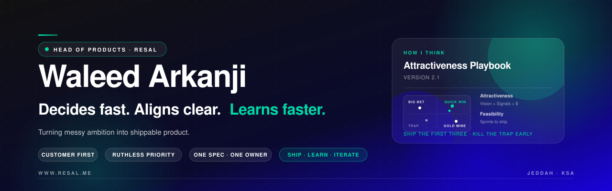

<!-- ============================================================ -->
<!-- Waleed Arkanji · Head of Products · Resal                     -->
<!-- ============================================================ -->

  

  
  
  

---

### `> whoami`

I'm **Waleed Arkanji** — Head of Products at **[Resal](https://resal.me)**, building in Jeddah.

My job is turning messy ambition into shippable product. I care about clarity, pace, and the quiet craft of deciding what not to build.

---

### `> how I think`

The lens I use to make calls:

**Attractiveness** (Vision Fit × Market Signals × Financial Potential) vs **Feasibility** (sprints to ship).

Four outcomes: **Quick Win · Big Bet · Gold Mine · Trap.** Ship the first three. Name the fourth early and walk away.

---

### `> principles`

> **Customer first.** Product quality second. Business metrics third. In that order. Every time.

- **New direction over old labels.** The category I came from isn't the category I'm building for.
- **Copy competitors? Never.** Understand them, then outbuild them.
- **Ruthless prioritization.** If everything is a priority, nothing is.
- **One spec, one owner, one sprint at a time.**

---

### `> stack`

  
  
  
  
  
  
  

---

### `> github`

  
  

<picture>
  <source media="(prefers-color-scheme: dark)" srcset="https://raw.githubusercontent.com/warkanji/warkanji/output/snake-dark.svg" />
  <source media="(prefers-color-scheme: light)" srcset="https://raw.githubusercontent.com/warkanji/warkanji/output/snake-light.svg" />
  
</picture>

---

### `> currently curious about`

- **Agentic workflows in everyday ops.** Where does the human stay, and where does the agent take over?
- **Arabic-first product design.** Not translation — transcreation. The whole experience.
- **Wallets as identity.** A wallet isn't a place for money. It's a place for trust.
- **Self-service as craft.** The best onboarding is the one that doesn't need a call.

---

  <i>Built in Jeddah · Learning in public.</i>

<!-- ============================================================ -->
<!-- Last updated April 2026                                       -->
<!-- ============================================================ -->
